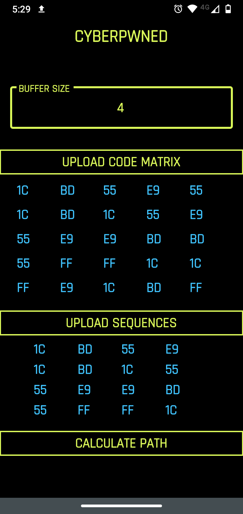
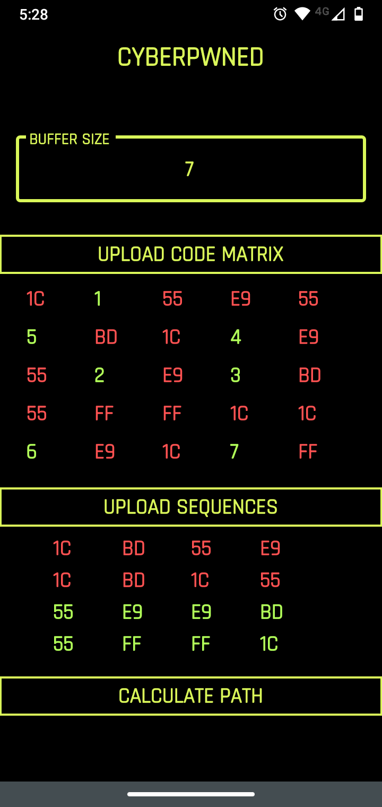

# cyberpwned

Cyberpunk 2077 Hacking Minigame Resolver

## Requirements
    - Flutter
        - Currently tested with version 1.22.5
        - https://flutter.dev/
    - A personal Firebase project
        - Required to get a valid google-services.json file
        - https://support.google.com/firebase/answer/7015592?hl=en
    - Android Studio/IntelliJ with Flutter plugin
        - Not entirely required, but should allow you to test the app without having to side-load it into your phone

## Installing and running

Make sure you copy your google-services.json file to android/app, otherwise you'll get a build error and won't be able to compile the application.

There are several ways of trying out the app:
* From the command line, you can do ```flutter build apk``` which should generate a app-release.apk file in build/outputs/apk/release. You should then be able to side-load the app into your phone.
* If you're using Android Studio/IntelliJ with the Flutter plugin installed, take a look at the following guide: https://flutter.dev/docs/get-started/test-drive?tab=androidstudio#run-the-app. Assuming you're using an emulator, you'll need to configure a webcam to actually test the app: https://stackoverflow.com/a/30792615/4572619.
* If you'd like to run the application on your device without having to side-load it: https://stackoverflow.com/a/54526682/4572619
* If you're willing to side-load the APK file, download it from: https://github.com/nicolas-siplis/cyberpwned/releases






